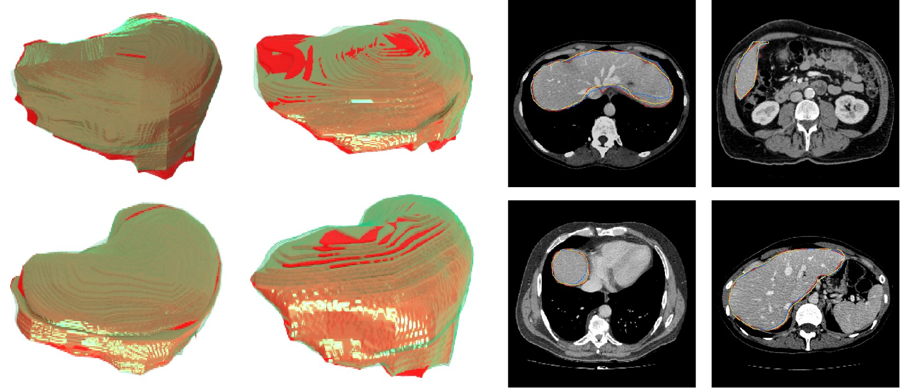

# AutoPath: Image-Specific Inference for 3D Segmentation


This code implements AutoPath, an image-specific inference approach, for more efficient 3D segmentations. The proposed AutoPath dynamically selects enabled residual blocks regarding different input images during inference, thus effectively reducing total computation without degrading segmentation performance. To achieve this, a policy network is trained using reinforcement learning, by employing the rewards of using a minimal set of residual blocks and meanwhile maintaining accurate segmentation.

This is the code accompanying the work:  
Dong Sun, Yi Wang, Dong Ni and Tianfu Wang. AutoPath: Image-Specific Inference for 3D Segmentation [[article]](https://www.frontiersin.org/articles/10.3389/fnbot.2020.00049/full)  


## Prerequisites
The code is written and tested using Python (3.6) and PyTorch (v1.3.1).

**Datasets**: We trained and tested our methods on data from LiTS challenge. You can click [here](https://competitions.codalab.org/competitions/17094) and follow the steps to download CT and ground truth.

## Training a segmentation model
In our research, we applied our method to trained segmentation models, so you need to train a residual segmentation model as follows if you do not have one. Checkpoints and tensorboard log files will be saved to folder specified in `--cv_dir`

```bash
# Train a segmentation model
python train_segmodel.py --model R50 -- data_dir /LiTS/train --gpu 0 --cv_dir cv/R50_try --lr 5e-3 --batch_size 4 --max_epochs 400
```

## Training an agent for reinforcement learning
Training occurs in **Curriculum Learning**.  
Models based on ResNets of different depths can be trained using the same script. Examples of how to train these models are given below. Checkpoints and tensorboard log files will be saved to folder specified in `--cv_dir`

The policy network can be trained using a CL schedule as follows.

```bash
# Train a DeepLab V3 based on a ResNet-101 backbone
python cl_training.py --gpu 0 --data_dir /LiTS/train --model R101 --cv_dir cv/R110_try --lr 1e-3 --batch_size 1 --max_epochs 10000
```


## Testing
Testing trained the segmentation model and agent as follows.
You can select mode among 4 default modes as following:
- auto: test segmentation model with AutoPath;
- full: test segmentation model fully;
- one: drop the n-th block;
- first: drop all blocks before the n-th;
- last: drop all blocks after the n-th block;
- random: drop n blocks randomly.

 Note that "first", "last" and "random" modes refer to  DropFirstN,  DropLastN and DropRandomN of Heuristic Dropping Strategies in our research respectively.
 
```bash
python test.py --gpu 0 --data_dir /LiTS/test --mode auto --model R101 --load_seg_model cv/segmodel/best.t7 --load_agent cv/policy/best.t7
```

## Results and Visualization
We draw the following analysis charts based on the sufficient experiments. Please see Sec. 3 in the paper for more detailed explanation.


Can be seen from the following table that by dropping the same number of residual blocks, our AutoPath outperformed other heuristic strategies by a large margin.


Following figures visualizes some 3D and 2D segmentation results obtained using AutoPath and full backbone, respectively. It can be observed that the segmentation performance from the proposed AutoPath was comparable to that of the full backbone architecture.


## Cite

If you find this repository useful in your own research, please consider citing:
```
@article{sun2020autopath,
  title={AutoPath: Image-Specific Inference for 3D Segmentation},
  author={Sun, Dong and Wang, Yi and Ni, Dong and Wang, Tianfu},
  journal={Frontiers in Neurorobotics},
  volume={14},
  year={2020},
  publisher={Frontiers Media SA}
}
```
